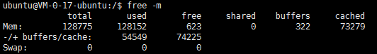
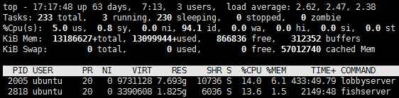

### 一、CPU和内存类
1. free

  1. Mem这一栏中 total是总的物理内存，used是被占用的物理内存，free是剩余的内存，shared已经废弃，buffers是指要输出到disk(块设备)的数据，cached是指从disk读出的数据。
  2. -/+buffers/cache used是应用程序认为系统被用掉的内存，free是应用程序认为系统还有多少内存。解释一下因为Mem栏中buffers和cached占用的内存可以被快速的回收，所以这一栏free=Mem栏中的free+buffers+cached
  3. Swap(交换区)
    * Swap是指将内存中没被用到的数据存储到硬盘上去，放到硬盘中的内存就可以被重新使用。硬盘中的数据等需要用到的时候在放回内存。
    * total是交换区硬盘的总大小，used是交换区硬盘被使用的大小，free是交换区硬盘剩余的大小。
    * 交换区中的used值很大的时候并不能说明内存不够用了，而是一直在变化的时候说明内存不够用了
  4. -m 是用M为单位显示

2. top

  1. 第一行
    * \- 17:17:48  # 当前系统时间
    * up 63 days, 7:13 #  
